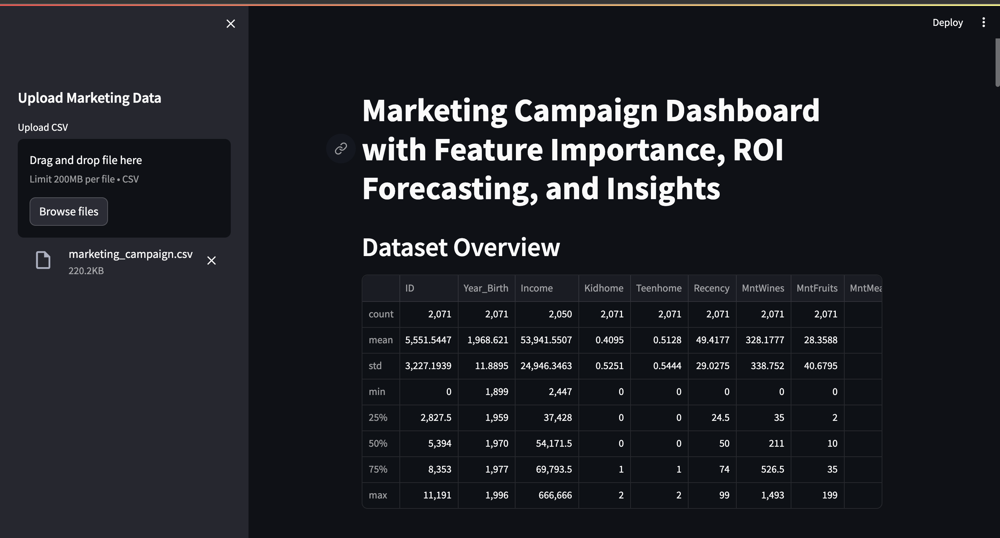
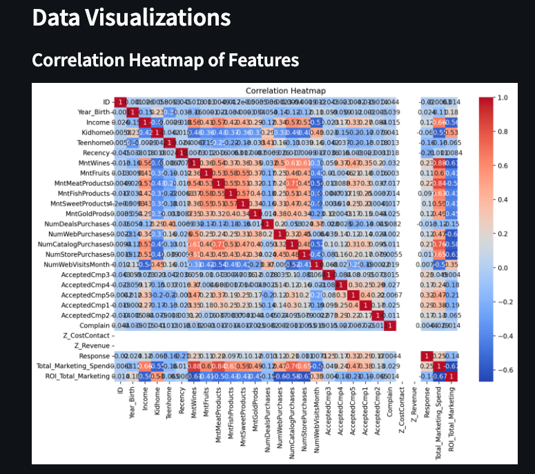
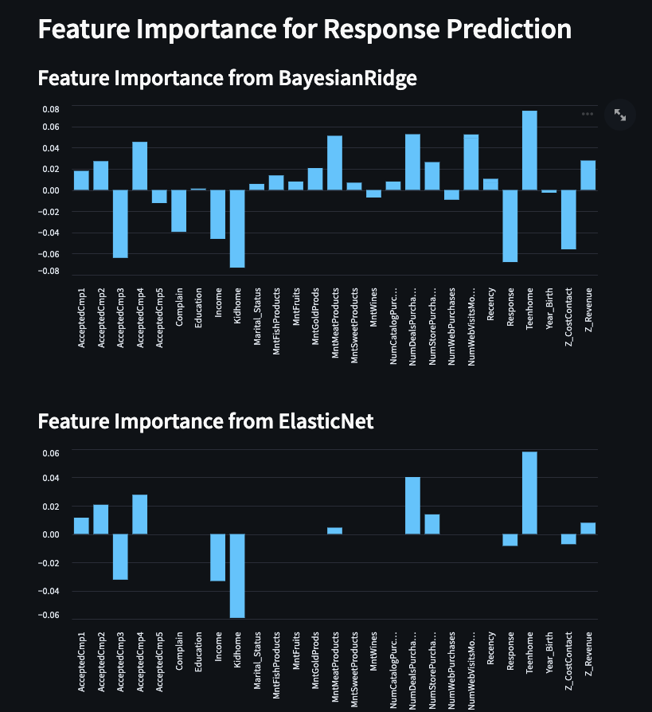
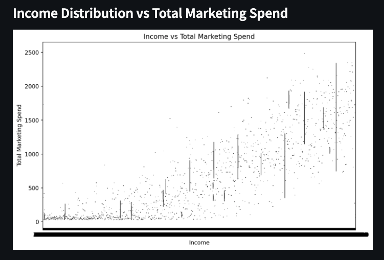
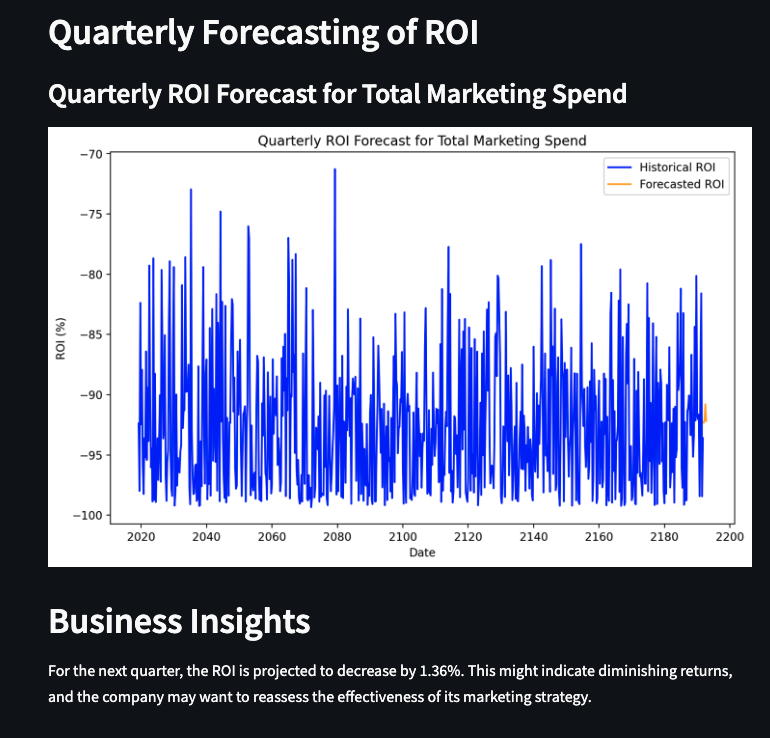

# Marketing Mix Model Dashboard with Feature Importance & ROI Forecasting

This Streamlit app is designed for marketing teams to visualize and forecast the effectiveness of marketing campaigns. The app provides the following functionalities:
1. **Feature Importance** based on pre-trained models (Ridge, Bayesian Ridge, ElasticNet) for predicting customer response.
2. **ROI Forecasting** using time-series analysis (ARIMA).
3. **Data Visualizations** such as correlation heatmaps, box plots, and scatterplots to provide insights into key marketing metrics.

## Table of Contents
- [Features](#features)
- [Installation](#installation)
- [Usage](#usage)
- [Dashboard Overview](#dashboard-overview)
- [Business Insights](#business-insights)
- [Contributing](#contributing)
- [License](#license)

## Features

- **Feature Importance**: Extracts and visualizes the most important features influencing the customer response to marketing campaigns.
  
- **ROI Forecasting**: Forecasts Return on Investment (ROI) for marketing spend using ARIMA time-series modeling.
  
- **Data Visualizations**: Includes multiple visualizations:
  - **Correlation Heatmap** to show relationships between numerical features.
  - **Box Plot** of Income vs Total Marketing Spend.
  - **Scatter Plot** showing Response vs Recency.

- **Business Insights**: Provides key insights based on ROI forecasting.

## Installation

1. Clone this repository to your local machine:

   ```bash
   git clone https://github.com/your-username/marketing-mix-model-dashboard.git
   cd marketing-mix-model-dashboard
   ```

2. Set up a virtual environment and install the required packages:

   ```bash
   python3 -m venv venv
   source venv/bin/activate  # For Windows: venvScriptsactivate
   pip install -r requirements.txt
   ```

3. Run the Streamlit app:

   ```bash
   streamlit run app.py
   ```

## Usage

1. **Upload a CSV File**: The app will ask for a CSV file containing the marketing campaign data.
   
   The dataset should have columns for marketing spend, demographic data, and customer response. Example columns include:
   - `Income`, `MntWines`, `MntFruits`, `Recency`, `Response`, etc.

2. **Visualize Data**: 
   - Once the file is uploaded, you can visualize key metrics, such as correlations between features, and box plots of total marketing spend.
   
3. **Feature Importance**: The dashboard will show the top features that affect customer response, based on pre-trained models (Bayesian Ridge, ElasticNet, Ridge).
   
4. **ROI Forecasting**: The app will forecast ROI based on historical marketing spend and provide future projections.

## Dashboard Overview

The Dashboard is also Deployed at https://marketingmixmodel.streamlit.app/, upload the dataset from this repositories data folder to see the analysis and forecasting.

### 1. Correlation Heatmap



The correlation heatmap shows the relationships between numerical features, helping you understand how different factors correlate with each other.

### 2. Feature Importance



This chart shows the top features impacting customer response to marketing campaigns based on the pre-trained models.

### 3. Income vs Total Marketing Spend (Box Plot)



This box plot visualizes the relationship between income levels and total marketing spend, helping to analyze customer spending behavior.

### 4. ROI Forecasting



The ROI forecast provides a quarterly projection of future returns, helping the marketing team allocate budgets efficiently.

## Business Insights

- **ROI Forecast Insights**:
  - The dashboard provides a detailed forecast of ROI for the next quarter using ARIMA time-series modeling.
  - It also provides recommendations based on projected increases or decreases in ROI.

### Example Insight:
> For the next quarter, the ROI is projected to increase by **12.5%**. This suggests that the company may see improved returns, and allocating more resources to marketing could enhance overall profitability.

## Contributing

I welcome contributions! Please fork the repository and submit a pull request. You can reachout to me at dharmojupavankumar@gmail.com
